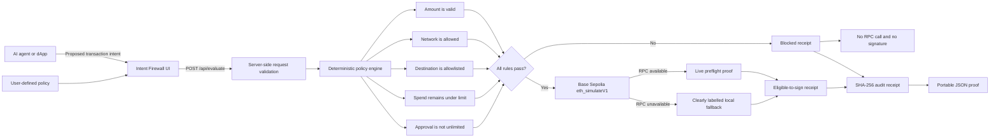

# Intent Firewall architecture

## Trust boundary

The prototype evaluates transaction proposals but does not hold keys, connect a wallet, create signatures, broadcast transactions, or move funds. Production protection would require every agent-initiated wallet action to pass through a policy-controlled signer; any transaction path that bypasses that signer is outside the firewall.

## Request lifecycle

1. The agent or dApp proposes an action, amount, network, destination, and approval scope.
2. The server validates the request shape and evaluates five deterministic rules.
3. A failed rule returns a block receipt before any network request.
4. An allowed Base request is simulated against pending Base Sepolia state.
5. The server canonicalizes the policy, intent, evaluation and execution evidence and produces an `ifw-v1` content-addressed audit receipt.
6. The interface shows policy evidence, execution proof and cryptographic fingerprints separately, and lets the user copy the complete JSON proof.

## Audit receipt boundary

The receipt provides reproducible SHA-256 integrity fingerprints for the decision content. It is not a wallet signature and does not prove the identity of the server. A production system can anchor or sign the same decision hash through its policy-controlled signer.
