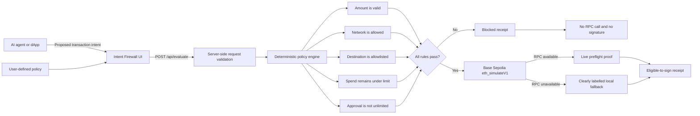

# Intent Firewall architecture

## Trust boundary

The prototype evaluates transaction proposals but does not hold keys, connect a wallet, create signatures, broadcast transactions, or move funds. Production protection would require every agent-initiated wallet action to pass through a policy-controlled signer; any transaction path that bypasses that signer is outside the firewall.

## Request lifecycle

1. The agent or dApp proposes an action, amount, network, destination, and approval scope.
2. The server validates the request shape and evaluates five deterministic rules.
3. A failed rule returns a block receipt before any network request.
4. An allowed Base request is simulated against pending Base Sepolia state.
5. The interface shows the policy evidence and execution proof separately, making it clear whether a request was blocked, preflighted, or evaluated using the fallback.
